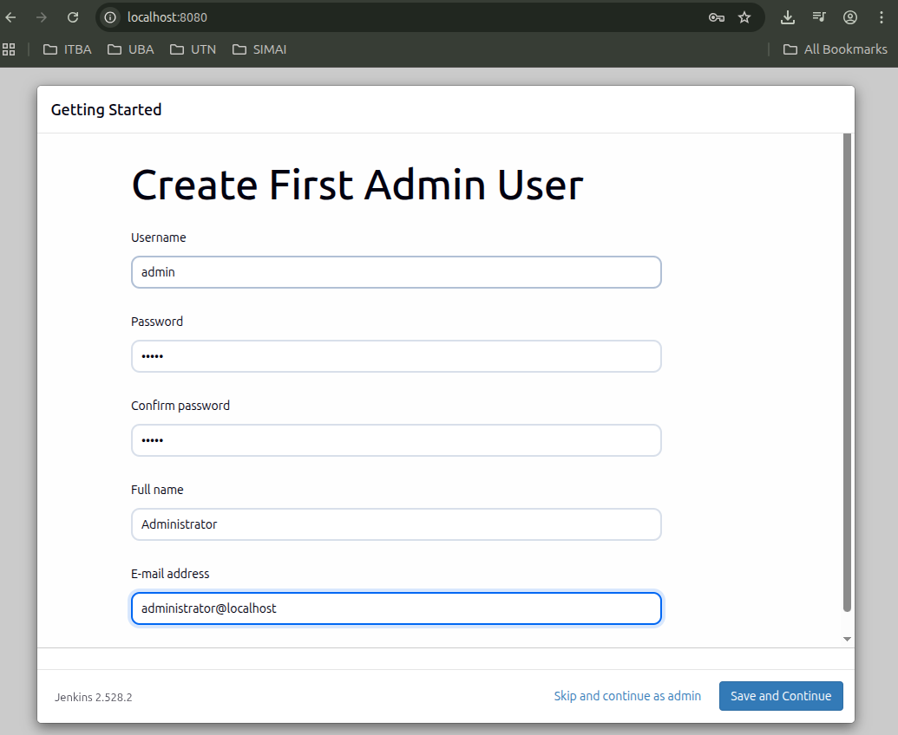
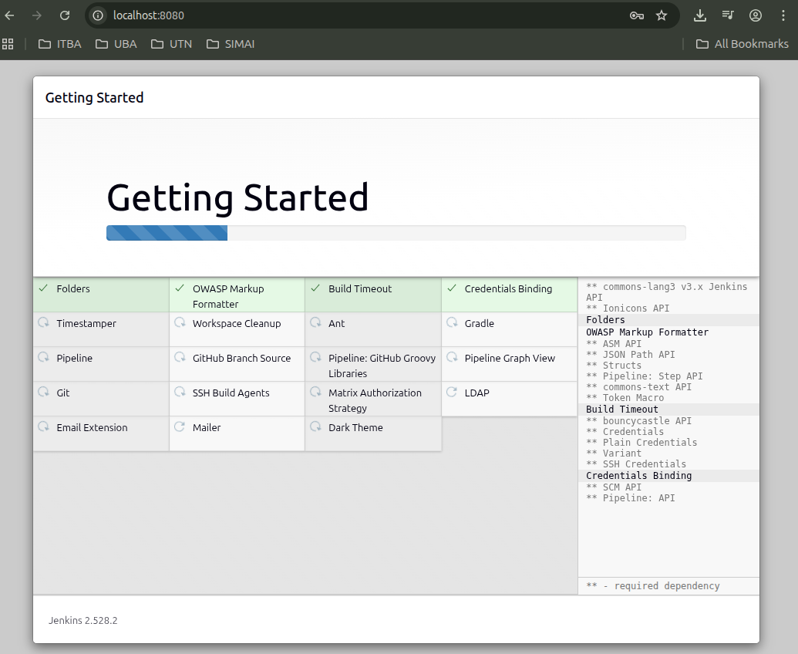

# Proyecto Vagrant + Puppet + Jenkins

Este entorno implementa una máquina virtual Ubuntu 22.04 (Jammy) aprovisionada con Puppet Server, Puppet Agent y Jenkins mediante un conjunto de scripts de shell y manifiestos Puppet. El objetivo es contar con un laboratorio reproducible para prácticas de DevOps e Infraestructura como Código.

---

##  Componentes implementados

### 1. **Puppet Master + Puppet Agent en la misma VM**
El provisioning instala:
- Puppet Master (server)
- Puppet Agent (cliente)
- Java OpenJDK 17 (requisito de Puppet Server)
- Gestión del usuario y grupo `puppet`
- Habilitación del agente Puppet como servicio

---

### 2. **Archivo `puppet.conf`**
Incluido en el host y transferido a la VM por el script de aprovisionamiento:

```ini
[main]
environment = production

[master]
ssl_client_header = SSL_CLIENT_S_DN
ssl_client_verify_header = SSL_CLIENT_VERIFY
certname = ubuntu-devops
report = true
reports = log

[agent]
server = ubuntu-devops
certname = ubuntu-devops
pluginsync = true
report     = true
summarize  = true
runinterval = 30m
report = true
```

Este archivo configura al agente para comunicarse con el servidor Puppet interno y define el entorno de trabajo.

---

### 3. **Puppet Module: Jenkins**
Se creó el módulo `jenkins` dentro de `puppet/modules/jenkins/manifests/init.pp`, el cual:

- Instala OpenJDK
- Agrega la clave y repositorio oficial de Jenkins
- Ejecuta `apt update` automáticamente cuando cambia el repo
- Instala el paquete `jenkins`
- Habilita y levanta el servicio Jenkins

Manifiesto principal (`site.pp`):

```puppet
node default {
  include jenkins
}
```

Jenkins queda expuesto en el puerto **8080**, accesible desde el host.

---

### 4. **Script para agregar entrada en `/etc/hosts`**
Se creó un script en Bash que asegura que la siguiente línea exista:

```
127.0.0.1   ubuntu-devops
```

Script:

```bash
HOST_FILE="/etc/hosts"
NEW_LOCALHOST="127.0.0.1  ubuntu-devops"

echo "Agregando entrada a /etc/hosts..."
echo "$NEW_LOCALHOST" | sudo tee -a "$HOST_FILE" > /dev/null
```

---

### 5. **Provisioning Script (`provision_puppet.sh`)**
Este script realiza:

- Instalación de Puppet Server y Agent
- Gestión del usuario y grupo `puppet`
- Ajuste de memoria de Puppet Server para funcionar en una VM de 2GB (`-Xms512m -Xmx512m`)
- Transferencia desde el host de:
  - `puppet.conf`
  - `manifests/`
  - `modules/`
- Habilitación del servicio Puppet Agent
- Levantado del servicio Puppet Server

---

##  Acceso a Jenkins

En el `Vagrantfile` se requiere exponer el puerto:

```ruby
config.vm.network "forwarded_port", guest: 8080, host: 8080
```

Luego ingresar desde el host:

```
http://localhost:8080
```

---

##  Estructura del proyecto en el Host

```
puppet/
├── puppet.conf
├── manifests/
│   └── site.pp
└── modules/
    └── jenkins/
        └── manifests/
            └── init.pp
provision.sh
Vagrantfile
```

---

##  Estado final del laboratorio



