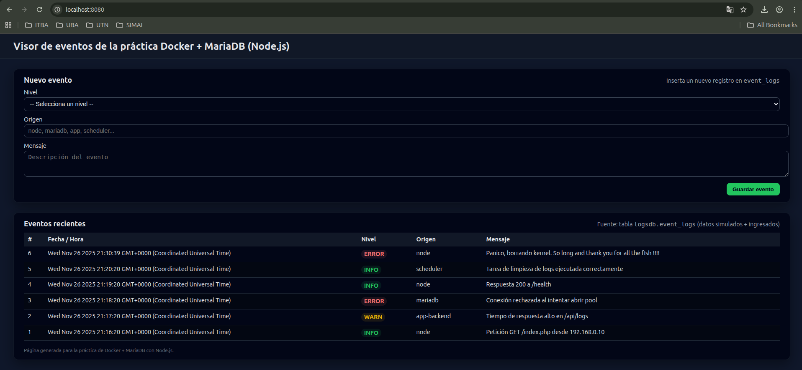

# Práctica DevOps: Vagrant + Docker + Node.js + MariaDB

Este proyecto contiene una práctica integrada donde se levanta una máquina virtual con **Vagrant** y, dentro de ella, se despliega una aplicación web en **Node.js** conectada a una base de datos **MariaDB** usando **Docker** y **docker compose**.

La aplicación es un pequeño **visor de eventos (logs)** que permite:
- Ver registros almacenados en la tabla `event_logs` de la base `logsdb`.
- Insertar nuevos eventos mediante un formulario web.

---

## Estructura del repositorio

```text
.
├── Vagrantfile
├── provision.sh
├── README.md
└── Docker/
    └── utn-devops-app/
        ├── Dockerfile
        ├── docker-compose.yml
        ├── README.md       # README específico de la app
        ├── app/
        │   ├── package.json
        │   └── server.js
        └── db/
            └── db_init.sql
```

### Archivos principales

- **Vagrantfile**  
  Define una VM (por ejemplo basada en Ubuntu) que se levanta con Vagrant, configura red, recursos básicos y ejecuta el script `provision.sh` como _provisioner_.

- **provision.sh**  
  Script de aprovisionamiento que, dentro de la VM:
  - Actualiza la lista de paquetes.
  - Instala `docker` y `docker-compose` (según la versión que se haya preparado).
  - Descarga o asegura la presencia del proyecto `Docker/utn-devops-app`.
  - Ejecuta `docker compose up -d --build` dentro del directorio de la app para levantar los contenedores.

- **Docker/utn-devops-app/Dockerfile**  
  Define la imagen de la aplicación Node.js:
  - Parte de `node:20-alpine`.
  - Establece el `WORKDIR` en `/usr/src/app`.
  - Copia `app/package*.json` para instalar dependencias (`npm install --omit=dev`).
  - Copia el resto del código de la carpeta `app/`.
  - Expone el puerto **80** dentro del contenedor.
  - Usa `npm start` como comando de entrada.

- **Docker/utn-devops-app/docker-compose.yml**  
  Orquesta dos servicios:
  - `webapp`: build desde el Dockerfile, expone el puerto `8080` del host al `80` del contenedor.
  - `mariadb`: usa la imagen oficial `mariadb:11` y configura:
    - `MARIADB_ROOT_PASSWORD`
    - `MARIADB_DATABASE=logsdb`
    - `MARIADB_USER=logsuser`
    - `MARIADB_PASSWORD=logspass`  
    Monta:
    - `./db/db_init.sql` en `/docker-entrypoint-initdb.d/db_init.sql` (para inicializar la base).
    - Un volumen `db_data` para persistencia de datos.

- **Docker/utn-devops-app/app/server.js**  
  Servidor Node.js con **Express** que:
  - Se conecta a MariaDB usando `mysql2/promise` y un **pool de conexiones**.
  - Usa variables de entorno (o valores por defecto) para configurar la base:
    - `DB_HOST` (por defecto `mariadb`)
    - `DB_NAME` (por defecto `logsdb`)
    - `DB_USER` (por defecto `logsuser`)
    - `DB_PASS` (por defecto `logspass`)
  - Expone un formulario HTML para crear nuevos eventos y una tabla para listar los últimos registros en `event_logs`.
  - Escucha en el puerto **80** dentro del contenedor (configurable con la variable `PORT`).

- **Docker/utn-devops-app/app/package.json**  
  Define el proyecto Node.js:
  - Dependencias:
    - `express`
    - `mysql2`
  - Script:
    - `"start": "node server.js"`

- **Docker/utn-devops-app/db/db_init.sql**  
  Script de inicialización que, cuando el contenedor de MariaDB se levanta por primera vez:
  - Crea la base `logsdb` (si no existe).
  - Crea el usuario `logsuser` con contraseña `logspass` y le otorga permisos sobre `logsdb`.
  - Crea la tabla `event_logs`:
    - `id` (clave primaria, autoincremental)
    - `event_time` (fecha/hora del evento)
    - `level` (nivel: INFO, WARN, ERROR, etc.)
    - `source` (origen del evento)
    - `message` (detalle del evento)
  - Inserta algunos eventos de ejemplo para probar el visor.

---

## Requisitos previos

En la **máquina host** necesitas tener instalado:

- **Vagrant**
- **VirtualBox** (u otro provider compatible configurado en el Vagrantfile)
- Conectividad a internet (para descargar la box base, paquetes y las imágenes de Docker).

Dentro de la **VM**, el `provision.sh` se encargará de instalar:

- Docker
- docker compose
- Dependencias necesarias para la práctica

---

## Puesta en marcha

### 1. Levantar la máquina virtual con Vagrant

Desde el directorio raíz donde se encuentra el `Vagrantfile`:

```bash
vagrant up
```

Esto va a:
1. Descargar la box base (la primera vez).
2. Crear y bootear la VM.
3. Ejecutar el script `provision.sh` dentro de la VM.

Para conectarte a la VM:

```bash
vagrant ssh
```

### 2. Verificar Docker dentro de la VM

Dentro de la VM, valida que Docker funciona:

```bash
docker ps
```

Deberías ver una lista (quizás vacía, pero sin errores).

### 3. Levantar los contenedores de la aplicación

Si el `provision.sh` ya ejecutó `docker compose up -d --build`, la app debería estar corriendo.  
Si necesitás hacerlo manualmente:

```bash
cd /vagrant/Docker/utn-devops-app
docker compose up -d --build
```

Esto construirá la imagen de la webapp y levantará los servicios `webapp` y `mariadb`.

### 4. Acceder a la aplicación web

En tu host, abre un navegador y visita:

```text
http://localhost:8080
```

Te aparecerá el **visor de eventos**:
- En la parte superior, un formulario para crear nuevos eventos.
- Debajo, una tabla con los eventos existentes, incluyendo los registros creados por `db_init.sql`.




---

## Flujo de datos

1. El usuario accede a `http://localhost:8080`.
2. El contenedor `webapp` (Node.js) recibe la petición en su puerto 80 y renderiza la página HTML.
3. Para mostrar la tabla de eventos, `server.js` consulta la tabla `event_logs` en la base `logsdb` del contenedor `mariadb`.
4. Cuando se envía el formulario, el servidor inserta un nuevo registro en `event_logs` con la fecha/hora actual (`NOW()` en SQL).
5. Al redirigir nuevamente a `/`, la tabla muestra el nuevo registro junto con los existentes.

---

## Comandos útiles

Dentro de la VM:

Listar contenedores en ejecución:

```bash
docker ps
```

Ver logs de la webapp:

```bash
docker logs -f <id_o_nombre_del_contenedor_webapp>
```

Ver logs de MariaDB:

```bash
docker logs -f <id_o_nombre_del_contenedor_mariadb>
```

Detener la aplicación (contenedores):

```bash
cd /ruta/al/proyecto/Docker/utn-devops-app
docker compose down
```

Apagar la VM:

```bash
exit      # salir de la sesión SSH
vagrant halt
```

Destruir la VM (para recrear desde cero):

```bash
vagrant destroy -f
```